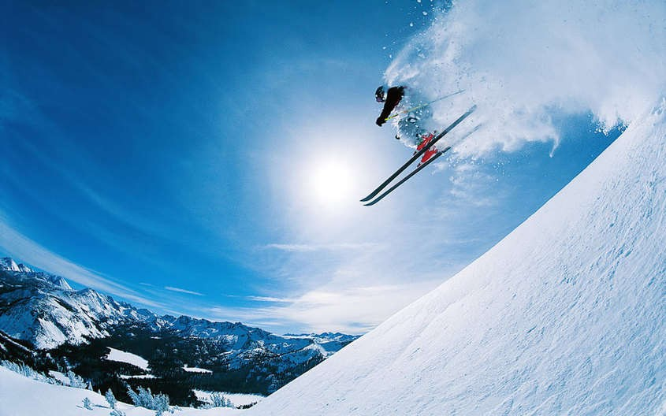
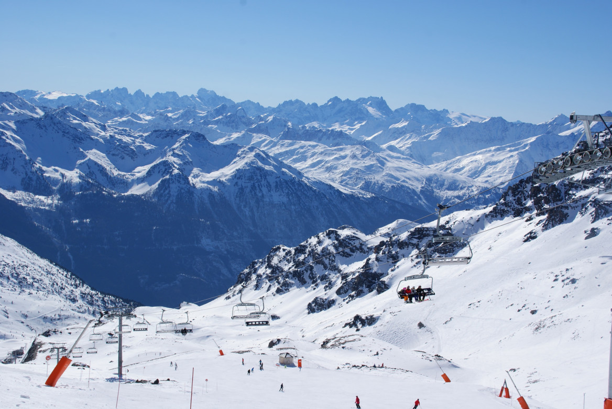

Val Di Sole

slidinėjimas Italija

>Val Di Sole slėnis dolomitinėse alpėse itin pamėgtas dėl didelio saulėtų dienų skaičiaus, geros infrastruktūros ir, žinoma, pasakiškų dolomitinių alpių vaizdų. Dėka Folgarida Marileva, Modonna di Campiglio ir Pinzolo kurortus jungiančių 62 keltuvų sistemos, judėti tarp jų galėsite nenusiimant slidžių. Bendras regiono trasų kilometražas –  150 km, kuris pasidalina į 50 km. mėlynų, 67 km. raudonų ir 33 km. juodų trasų. Val di Sole itin populiarus šeimų tarpe, kadangi čia gausu slidinėjimo mokyklų, slidinėjimo parkų patiems mažiausiems, o apgalvota infrastruktūra tarp kurortų susisiekti patogiai leidžia ir su mažaisiais slidininkais.



You can also write code blocks here!

```js
const saltyDuckEgg = "chinese preserved food product"
```

Apie kurorta

    Trasų kilometražas – 150 km.
    Trasos pagal sudėtingumą – 50 km. mėlynų, 67 km. raudonų ir 33 km. juodų trasų.
    Didžiausias aukštis – 3000 m.
    Keltuvų skaičius – 62
    Sniego parkų skaičius – 1
    Atstumas iki trasų – 800 m. Ski bus stotelė priešais viešbutį|

[View raw (TEST.md)](https://raw.github.com/adamschwartz/github-markdown-kitchen-sink/master/README.md)


 Vialattea

     Tarptautinis Italijos slidinėjimo kurortas Vialattea susideda iš Sestriere, 
     Sauze d’Oulx, Oulx, Sansicario, Cesana, Pragelato, Claviere ir jau 
     Prancūzijos pusėje esančiu Montgenevre kurortu. 
     Kartu jie leidžia mėgautis daugiau nei 400 km trasų ir yra tarp geriausių 
     bei populiariausių Italijos kurortų. Slidinėjama 1372m. – 2789m. aukščiuose.




Kelionės eiga padieniui

    1 diena
    12:05 - 13:45 Skrydis Vilnius (VNO) - Milano Malpensa (MXP). Skrydžio numeris W6 8051, Wizz Air avialinijos. Skrydžio trukmė – 2:40 val.
    Pervežimas iš oro uosto į Pinzolo miestelį. Pervežimo trukmė – 3 val. Atvykstame į viešbutį, įsikuriame ir vakarieniaujame. Sekmadienio rytą pradedame slidinėti.

    2–7 diena
    Slidinėjimas Campiglio Dolomiti Di Brenta. Šioje kelionėje galėsite pasinaudoti licencijuoto slidinėjimo instruktoriaus paslaugomis. Kiekvienam klientui - vienos valandos trukmės nemokama pamoka pagal iš anksto numatytą grafiką bei taisykles (informacija išvykimo programoje).

    8 diena
    11:00 išsiregistravimas iš apartamentų. Pervežimas Collini viešbutis - Milano Malpensa oro uostas. 14:20 - 17:55 skrydis Milano Malpensa (MXP) – Vilnius (VNO). Skrydžio numeris W6 8052

- Red
- Green
- Blue

* Red
* Green
* Blue

- Red
- Green
- Blue

```markdown
- Red
- Green
- Blue

* Red
* Green
* Blue

- Red
- Green
- Blue
```

- `code goes` here in this line
- **bold** goes here

```markdown
- `code goes` here in this line
- **bold** goes here
```

1. Buy flour and salt
1. Mix together with water
1. Bake

```markdown
1. Buy flour and salt
1. Mix together with water
1. Bake
```

1. `code goes` here in this line
1. **bold** goes here

```markdown
1. `code goes` here in this line
1. **bold** goes here
```

Paragraph:

    Code

<!-- -->

    Paragraph:

        Code

---

---

---

---

---

    * * *

    ***

    *****

    - - -

    ---------------------------------------

This is [an example](http://example.com "Example") link.

[This link](http://example.com) has no title attr.

This is [an example][id] reference-style link.

[id]: http://example.com "Optional Title"

    This is [an example](http://example.com "Example") link.

    [This link](http://example.com) has no title attr.

    This is [an example] [id] reference-style link.

    [id]: http://example.com "Optional Title"

_single asterisks_

_single underscores_

**double asterisks**

**double underscores**

    *single asterisks*

    _single underscores_

    **double asterisks**

    __double underscores__

This paragraph has some `code` in it.

    This paragraph has some `code` in it.


    
